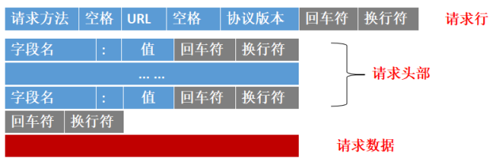
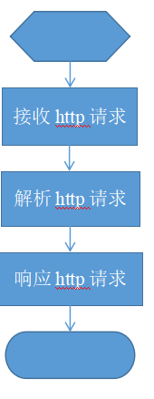
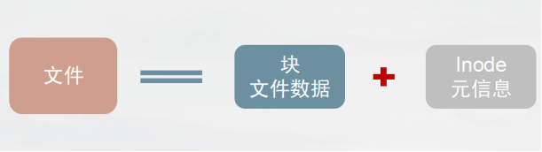
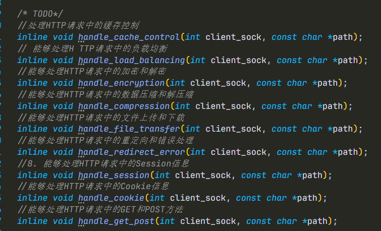
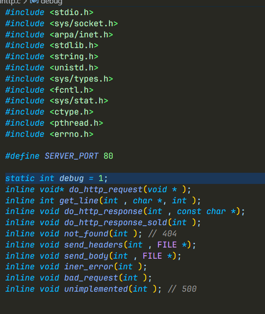

# 使用C语言实现Linux下的并发Http服务器

[TOC]

## 先备知识

> - 熟悉Linux的网络编程
>
> - 熟悉C语言的使用
>
> - 熟悉Get等Http请求
>
>   

   ***\*html\****，全称Hypertext Markup Language，也就是“超文本链接标示语言”。HTML文本是由 HTML命令组成的描述性文本，HTML 命令可以说明文字、 图形、动画、声音、表格、链接等。 即平常上网所看到的的网页。

## Http协议

 HTTP协议是Hyper Text Transfer Protocol(超文本传输协议)的缩写,是用于从万维网(WWW:World Wide Web )服务器传输超文本到本地浏览器的传送协议。

#### 请求格式：

 ##### 客户端请求

客户端发送一个HTTP请求到服务器的请求消息包括以下格式：请求行（request line）、请求头部（header）、空行和请求数据四个部分组成，下图给出了请求报文的一般格式。

​    

##### 服务端响应

服务器响应客户端的HTTP响应也由四个部分组成，分别是：状态行、消息报头、空行和响应正文。

| 内容                                       | 响应代号 | 代号描述               |
| ------------------------------------------ | -------- | ---------------------- |
| 服务器上存在请求的内容，并可以响应给客户端 | 200      | OK                     |
| 客户端的请求有异常，方法有问题             | 501      | Method Not Implemented |
| 服务器收到请求后，因为自生的问题没法响应   | 500      | Internal Server Error  |
| 请求的内容不存在                           | 404      | NOT FOUND              |
| 客户端发送的请求格式有问题等               | 400      | BAD REQUEST            |

#### Demo

~~~http
浏览器请求：
GET /demo.html HTTP/1.1
Host: 47.100.162.**
Connection: keep-alive
User-Agent: Mozilla/5.0 (Windows NT 10.0; WOW64) AppleWebKit/537.36 (KHTML, like Gecko) Chrome/63.0.3239.26 Safari/537.36 Core/1.63.6788.400 QQBrowser/10.3.2767.400
Upgrade-Insecure-Requests: 1
Accept: text/html,application/xhtml+xml,application/xml;q=0.9,image/webp,image/apng,*/*;q=0.8
Accept-Encoding: gzip, deflate
Accept-Language: zh-CN,zh;q=0.9
Cookie:cna=BT0+EoVi1FACAXH3Nv5I7h6k;isg=BIOD99I03BNYvZDfE2FJUOsMB0ftUBZcBFi4E7VgYOJZdKOWPcvRinAl6kSfVG8y

 
~~~

~~~http
服务器响应：
HTTP/1.0 200 OK
Server: Martin Server
Content-Type: text/html
Connection: Close
Content-Length: 526
 ---一下为content-----
 
~~~

## 实现Mini的Http服务器流程

## 接收Http请求

### 实现按行读取请求头部

~~~cpp
inline int get_line(int , char *, int );
~~~

> //返回值： -1 表示读取出错， 等于0表示读到一个空行， 大于0 表示成功读取一行

~~~cpp
int get_line(int sock, char *buf, int size)
{

    int count = 0;
    int len = 0;
    char ch = '\0';

    while (count < (size - 1) && ch != '\n')
    {
        len = read(sock, &ch, 1);
        if (len == 1)
        {
            if (ch == '\r')
            {
                
                continue;
            }
            else if (ch == '\n')
            {
               
                break;
            }

            buf[count] = ch;
            count++;
        }
        else if (len == -1)
        {
            perror("read faild");
            count = 0;
            break;
        }
        else
        {
            fprintf(stderr, "client close the connect \n");
            count = 0;
            break;
        }
    }

    if (count >= 0)
        buf[count] = '\0';

    return count;
}

~~~

### 请求头部的结束

> ***\*如果碰到两个连续的回车换行，即，意味着请求头部结束\****

## 解析请求

> 返回值和参数都使用void* 方便后续使用多线程实现并发功能

~~~cpp
void * do_http_request(void * pclient_sock)
{

    int len;
    char buf[512];

    char url[256];

    char method[64];
    int client_sock = *(int *)pclient_sock;
    len =  get_line(client_sock, buf, sizeof(buf));

    // 读取客户端的请求

    // 读取请求行

   
    // printf("%s\n", buf);
    if (buf == '\0')
    {
        if (debug)
        {
            printf("No request line ,The buff is null\n");
        }
    }
    if (debug)
        printf("The len is %d\n", len);
    if (len > 0)
    {
        int i = 0, j = 0;

        while (!isspace(buf[j]) && (i < (sizeof(method) - 1)))
        {
            method[i] = buf[j];
            i++;
            j++;
        }
        method[i] = '\0';
        // printf("the method is \t:%s\n", method);
        if (strncasecmp(method, "GET", i) == 0)
        {
            // 处理GET请求
            if (debug)

                printf("method = GET\n");
            while (isspace(buf[j++])) // 跳过白空格

                i = 0;
            while (!isspace(buf[j]) && (i < (sizeof(url) - 1)))
            {

                url[i] = buf[j];
                i++;
                j++;
            }

            url[i] = '\0';

            if (debug)
                printf("The url is\t:%s\n", url);

            do
            {
                len = get_line(client_sock, buf, sizeof(buf));
                if (debug)
                    printf("read: %s\n", buf);
                /* code */
            } while (len > 0);

            /* 定位本地服务器的html文件*/

            //

            {
                char *pos = strchr(url, '?');
                if (pos)
                {
                    *pos = '\0';
                    printf("real url: %s\n", url);
                }
            }

            // 读取本地文件
            char path[512];
            sprintf(path, "./html_docs/%s", url);
            if (debug)
                printf("path is %s\n", path);

            struct stat st;
            // 读取文件

            if (stat(path, &st) == -1)
            {
                fprintf(stderr, "stat %s failed,reson :%s \n", path, strerror(errno));

                fprintf(stderr, "warning! file not found\n");
                // 返回404
                not_found(client_sock);
            }
            else
            {
                // 文件存在
                if (S_ISDIR(st.st_mode))
                {

                    strcat(path, "/index.html");
                    // 返回目录
                    fprintf(stderr, "warning! file is a dir\n");
                    // 返回404
                }
                do_http_response(client_sock, path);
            }
        }
        else
        {
            fprintf(stderr, "warning! other request[%s]\n", method);
            // 处理其他请求
            if (debug)
                printf("method != GET\n");

            // read http header ,and send error code to the client
            // 响应客户都 501 the method is not defined
            do
            {
                len = get_line(client_sock, buf, sizeof(buf));
                if (debug)
                    printf("read: %s\n", buf);

            } while (len > 0);

            // unimplemented(client_sock);//在响应时实现
        }

        // 读取Http的头部
    }
    else
    {
        // request error
        bad_request(client_sock);
    }
    close(client_sock);
	if(pclient_sock) free(pclient_sock);//释放动态分配的内存
	
	return NULL;
}

~~~

## 响应请求

~~~cpp
void do_http_response(int client_sock, const char *path)
{
    FILE *resource = NULL;
    resource = fopen(path, "r");
    if (resource == NULL)
    {
        not_found(client_sock);
        return;
    }
    int size = fseek(resource, 0, SEEK_END);

    // 发送http头部
    send_headers(client_sock, resource);

    // 发送http_body
    send_body(client_sock, resource);

    fclose(resource);
    return;
}
~~~

## 读取文件（http需要发送html下的html文件

文件概念简介

inode - "索引节点",储存文件的元信息，比如文件的创建者、文件的创建日期、文件的大小等等。每个inode都有一个号码，操作系统用inode号码来识别不同的文件。ls -i  查看inode 号

### stat函数

***\*作用：\****返回文件的状态信息

**头文件** ：

~~~c
#include <sys/types.h>

#include <sys/stat.h>

#include <unistd.h>
~~~

**函数体**：

~~~c
int stat(const char *path, struct stat *buf);
int fstat(int fd, struct stat *buf);
int lstat(const char *path, struct stat *buf);
~~~

path:

​	文件的路径

buf:

​	传入的保存文件状态的指针，用于保存文件的状态

返回值：

​	成功返回0，失败返回-1，设置errno

**结构体**：

~~~cpp
struct stat {
               dev_t     st_dev;     /* ID of device containing file */
               ino_t     st_ino;     /* inode number */
               mode_t    st_mode;    /* S_ISREG(st_mode)  是一个普通文件  S_ISDIR(st_mode)  是一个目录*/
               
               nlink_t   st_nlink;   /* number of hard links */
               uid_t     st_uid;     /* user ID of owner */
               gid_t     st_gid;     /* group ID of owner */
               dev_t     st_rdev;    /* device ID (if special file) */
               off_t     st_size;    /* total size, in bytes */
               blksize_t st_blksize; /* blocksize for filesystem I/O */
               blkcnt_t  st_blocks;  /* number of 512B blocks allocated */
               time_t    st_atime;   /* time of last access */
               time_t    st_mtime;   /* time of last modification */
               time_t    st_ctime;   /* time of last status change */
           };
~~~

## 响应文件的头部

~~~cpp

void send_headers(int client_sock, FILE *fp)
{
    struct stat st;
    if (fstat(fileno(fp), &st) == -1)
    {
        perror("fstat");
        return;
    }

    char buf[1024] = {0};
    strcpy(buf, "HTTP/1.0 200 OK\r\n");
    strcat(buf, "Content-Type: text/html; charset=utf-8\r\n");
    strcat(buf, "Server:Lucifer Web Server\r\n");
    strcat(buf, "Connection:close\r\n");
    char tmp[128];
    sprintf(tmp, "Content-Length: %ld\r\n", st.st_size);
    strcat(buf, tmp);
    if (debug)
    {
        fprintf(stdout, "send_body buf: %s\n", buf);
        fflush(stdout);
    }
    if (send(client_sock, buf, strlen(buf), 0) < 0)
    {
        sprintf(stderr, "send reply failed. reason: %s\n", strerror(errno));
    }
    // sendfile(client_sock, fileno(fp), NULL, st.st_size); // 发送文件内容
}

~~~

## 发送body

~~~cpp
}

void send_body(int client_sock, FILE *fp)
{
    char buf[1024];

    fgets(buf, sizeof(buf), fp);

    while (!feof(fp))
    {
        int len = write(client_sock, buf, strlen(buf));

        if (len < 0)
        { // 发送body 的过程中出现问题,怎么办？1.重试？ 2.
            fprintf(stderr, "send body error. reason: %s\n", strerror(errno));
            break;
        }

        if (debug)
            fprintf(stdout, "%s", buf);
        fgets(buf, sizeof(buf), fp);
    }
}
~~~

## 错误访问

###### 404

~~~cpp
void not_found(int client_sock)
{
    const char *reply = "HTTP/1.0 404 NOT FOUND\r\n\
    Content-Type: text/html\r\n\
    \r\n\
    <HTML lang=\"zh-CN\">\r\n\
    <meta content=\"text/html; charset=utf-8\" http-equiv=\"Content-Type\">\r\n\
    <HEAD>\r\n\
    <TITLE>NOT FOUND</TITLE>\r\n\
    </HEAD>\r\n\
    <BODY>\r\n\
        
file not find \r\n\
        
The server could not fulfill your request because the resource specified is unavailable or nonexistent.\r\n\
    </BODY>\r\n\
    </HTML>";

    int len = write(client_sock, reply, strlen(reply));
    if (debug)
        fprintf(stdout, reply);

    if (len <= 0)
    {
        fprintf(stderr, "send reply failed. reason: %s\n", strerror(errno));
    }
}
~~~

###### 500 

~~~c
void iner_error(int client_sock)
{
    const char *reply = "HTTP/1.0 500 Internal Sever Error\r\n\
    Content-Type: text/html\r\n\
    \r\n\
    <HTML>\
    <HEAD>\
    <TITLE>Method Not Implemented</TITLE>\
    </HEAD>\
    <BODY>\
        
Error prohibited CGI execution.\
    </BODY>\
    </HTML>";

    int len = write(client_sock, reply, strlen(reply));
    if (debug)
        fprintf(stdout, reply);

    if (len <= 0)
    {
        fprintf(stderr, "send reply failed. reason: %s\n", strerror(errno));
    }
}

~~~

###### 400

~~~c
void bad_request(int client_sock)
{
    // 400
    const char *reply = "HTTP/1.0 400 Bad Request\r\n\
    Content-Type: text/html\r\n\
    \r\n\
    <HTML>\
    <HEAD>\
    <TITLE>Bad Request</TITLE>\
    </HEAD>\
    <BODY>\
        
Error prohibited CGI execution.\
    </BODY>\
    </HTML>\r\n";
    int len = send(client_sock, reply, strlen(reply), 0);
    if (len < 0)
    {
        perror("send");
    }
    if (debug)
        printf("send bad request\n");
    return;
}
~~~

###### 501

~~~c
void unimplemented(int client_sock)
{

    const char *reply = "HTTP/1.0 501 Not Implemented\r\n\
    Content-Type: text/html\r\n\
    \r\n\
    <HTML>\
    <HEAD>\
    <TITLE>Not Implemented</TITLE>\
    </HEAD>\
    <BODY>\
        
Error prohibited CGI execution.\
    </BODY>\
    </HTML>";

    int len = write(client_sock, reply, strlen(reply));
    if (debug)
        fprintf(stdout, reply);

    if (len <= 0)
    {
        fprintf(stderr, "send reply failed. reason: %s\n", strerror(errno));
    }
}
~~~

## 一些待实现的函数

## 所需头文件

## 完整代码与讨论

# Q：723550115

 

